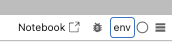
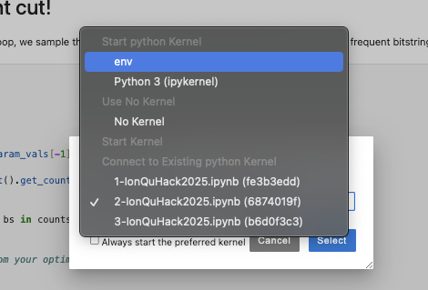

# Setup your machine
Install python 3.10

```angular2html
python3.10 -m venv env
source env/bin/activate
pip install --upgrade pip
pip install -r requirements.txt
python3 -m ipykernel install --user --name=env
jupyter lab
```




Sometimes, issues with AER occur, you can try:
```angular2html
pip install qiskit-aer --no-cache-dir --prefer-binary
```